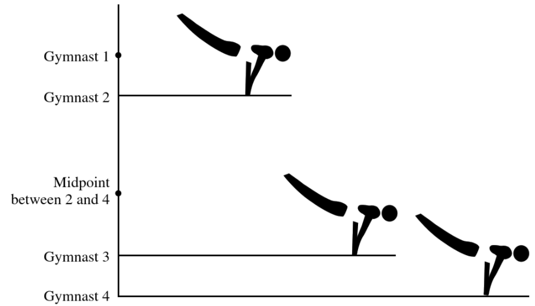
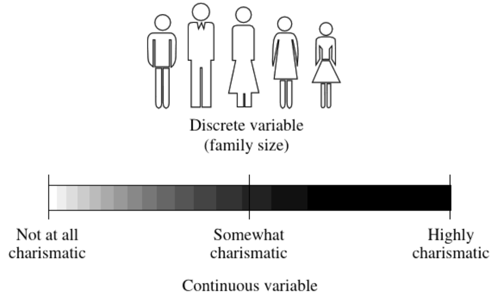
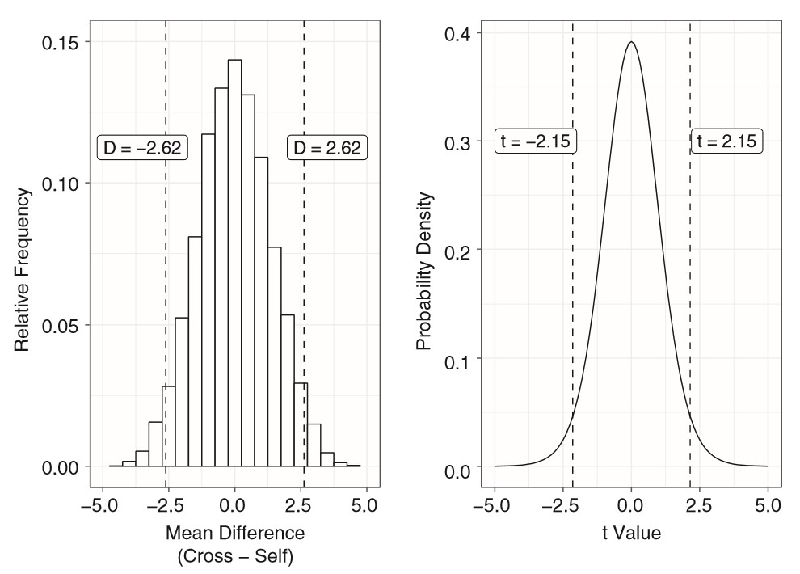

```{r setup, include=FALSE}
options(htmltools.dir.version = FALSE)
knitr::opts_chunk$set(comment     = NA,
                      cache       = TRUE,
                      echo        = TRUE, 
                      warning     = FALSE, 
                      message     = FALSE,
                      fig.align   = "center",   # center all figures
                      fig.width   = 6.5,          # set default figure width to 4 inches
                      fig.height  = 4.5)        # set default figure height to 3 inches
```

background-image: url(figures/StatStudio_Workshop_categorical_icon.png)
background-position: 50% 50%
background-size: 1200px


---

background-image: url(figures/fig_scale_variable.png)
background-position: 50% 80%
background-size: 600px

# Scale vs. Variable


---
# Scale vs. Variable

.pull-left[
## MEASUREMENT SCALE

.large[
- .coral[Nominal] = named groupings, no meaningful order
- .dcoral[Ordinal] = groupings that do have natural order
- .nicegreen[Interval] = precise units that are equally spaced
- .bluer[Ratio]	= interval + true zero point
]]

.pull-right[
## VARIABLE TYPE

.large[
- .coral[Categorical or Discrete] = finite, countable number of levels, no intermediate values possible	
- .nicegreen[Numeric or Continuous] = infinite intermediate values are possible, at least in theory
]

*NOTE: due to limits on measurement precision, observed data may be discrete, even though the underlying construct is continuous*
]


---

## Ordinal, Interval, Ratio

- .dcoral[Ordinal] = groupings that do have natural order
- .nicegreen[Interval] = precise units that are equally spaced
- .bluer[Ratio]	= interval + true zero point

.pull-left[

```{r,echo=FALSE}

```

]


.pull-right[

```{r,echo=FALSE}
knitr::include_graphics("figures/textbook_fig_1.2.PNG")
```

]


---

## Discrete vs. Continuous

- .coral[Categorical or Discrete] = finite, countable number of levels, no intermediate values possible	
- .nicegreen[Numeric or Continuous] = infinite intermediate values are possible, at least in theory


.pull-left[
```{r,echo=FALSE}

```
]

*NOTE: due to limits on measurement precision, observed data may be discrete, even though the underlying construct is continuous*

---

## SCORE EXAMPLES


.pull-left[

### Temperature

* **Nominal**
   + Comfortable vs Uncomfortable
   
* **Ordinal**
   + Ice, Chilly, Comfy, Warm, Hates

* **Interval**
   + Celsius (C)
   + Fahrenheit (F) 

* **Ratio**
   + Kelvin (K)
]


--

.pull-right[

### Depression

* **Nominal**
   + Early onset, Late onset, Chronic
   
* **Ordinal**
   + None, mild, moderate, severe

* **Interval-Ratio'ish**
   + Beck Depression Inventory, average of 21 Likert items each on a scale of 0-3

]

---

# STATISTICAL INFERENCE

### Hypothesis

* Null: no relationship or no difference
* Alternative: some relationship or a non-zero difference

### Assumptions

* independence of observations
* normality
* homogeneity of variance

### Test Statistic

* assuming the null hypothesis is true
* measure of the extremeness of our data

### p-values

> The probability of observing data as extreme or more extreme than what we observed, given the null hypothesis is true.


---

# TYPES of STATISTICAL INFERENCE

.pull-left[

## Parametric

* Based on a specific distribution (i.e. normal)
* Interval, ratio scales
* *can be* more powerful
* accuracy influenced by outliers

Ex) t-test, ANOVA, regression

]


--

.pull-right[

## Non-Parametric

* oftern used for ordinal or norminal scores
* NOT base on any specific distribution
* no assumption makes it more flexible

Ex) Exact tests, Mann-Whitney W, Rank tests

]

---

## Parametric vs. Non-Parametric - Situation A

**Type of Analysis**

Compare means between two distinct/independent groups

**Example Research Question**

Is the mean systolic blood pressure (at baseline) for patients assigned to placebo different from the mean for patients assigned to the treatment group?


**Parametric Method**

--

* Two-sample t-test 


.dcoral[**Non-parametric Method**]

--

.coral[
* Wilcoxon rank-sum test ]


---

## Parametric vs. Non-Parametric - Situation B

**Type of Analysis**

Compare two quantitative measurements taken from the same individual

**Example Research Question**

Was there a significant change in systolic blood pressure between baseline and the six-month followup measurement in the treatment group?

**Parametric Method**

--

* Paired t-test

.dcoral[**Non-parametric Method**]

--

.coral[
* Wilcoxon signed-rank test ]


---

## Parametric vs. Non-Parametric - Situation C


**Type of Analysis**

Compare means between three or more distinct/independent groups


**Example Research Question**

If our experiment had three groups (e.g., placebo, new drug #1, new drug #2), we might want to know whether the mean systolic blood pressure at baseline differed  among the three groups?


**Parametric Method**

--

* Analysis of variance (ANOVA)

.dcoral[**Non-parametric Method**]

--

.coral[
* Kruskal-Wallis test]


---

## Parametric vs. Non-Parametric - Situation D

**Type of Analysis**

Estimate the degree of association between two quantitative variables

**Example Research Question**

Is systolic blood pressure associated with the patient’s age?


**Parametric Method**

--

* Pearson coefficient of correlation

.dcoral[**Non-parametric Method**]

--

.coral[
* Spearman’s rank correlation]


---

# Randomization Test

NOT Parametric:

Assume a population's distribution and therefor the sampling distribution follows a specific distribution (like the normal curve)

IS Non-Parametric:

Determine the sampling distribution (called the “permutation distribution”) by **resampling the observed data**.


Specifically, we can “shuffle” or permute the observed data 

> by assigning different outcome values to each observation from among the set of actually observed outcomes

---

<!-- Ed Boone: The Randomization Test (Using R)  (12.5 min)-->

<iframe width="1000" height="750" src="https://www.youtube.com/embed/_a4EwbRK9cs?controls=0&amp;start=11" frameborder="10" allow="accelerometer; autoplay; encrypted-media; gyroscope; picture-in-picture" allowfullscreen></iframe>


---

## The general premise of randomization methods 

> "To summarize, Ronald Fisher first developed randomization methods in the mid-1930s. The general premise of randomization methods is that, under the $H_0$, scores from different groups should be **interchangeable**. Thus, researchers can determine the probability of obtaining a statistic from a given set of data by:
>
> (a) repeatedly rearranging data between groups, 
>
> (b) calculating the statistic of interest for each set of rearranged data (e.g., a mean difference or t-value), 
>
> (c) determining how many of those statistics are as extreme or more extreme than the statistic obtained from an experiment, and 
>
> (d) dividing that number of extreme statistics by the total number of statistics obtained by rearranging the data. 
>
> Following this basic logic, randomization-based alternatives have been developed for many of the statistical analyses that are common in the behavioral sciences."
>
> - [Randomization tests as alternative analysis methods for behavior-analytic data](https://www.ncbi.nlm.nih.gov/pmc/articles/PMC6524641/)


---

## Types of Randomization Tests

### Exact Methods

* Consider ALL possible rearrangements
* "Complete enumeration" of options
* "Fisher's Exact Test" for 2x2 contingency table


.pull-left[
### Permutations Methods

* Sample with-OUT replacement

* Best for hypothesis tests (exchangability)
]

.pull-right[
### Bootstrapping Methods

* Sample WITH replacement

* Best for confidence intervals (spread)
]


---

# Tests of Independence

## Hypotheses

Independence tests are used to determine if there is a significant **relationship between two categorical variables**. 

--
.bluer[
$$
H_0: \text{the variables are independent} 
$$

There is no relationship between the two categorical variables. Knowing the value of one variable does not help to predict the value of the other variable.
]

--

.nicegreen[
$$
H_1: \text{the variables are dependent}
$$

There is a relationship between the two categorical variables. Knowing the value of one variable helps to predict the value of the other variable.
]

---

## Tests of Independence

> Based on contingency table (cross tabulations) for 2 nominal variables 

### Chi-squared Test *(Traditional, Parametric)*

Used when the .nicegreen[sample is large enough]. The *p*-value is an **approximation** that becomes exact when the **sample becomes infinite**, which is the case for many statistical tests

--

### Fisher's Exact Test *(Randomized, Non-Parametric)*

Used when the .nicegreen[sample is small]. The *p*-value is **EXACT** and is not an approximation

--

### Selecting between the 2

Chi-square test is not appropriate when the .bluer[**expected values in one of the cells of the contingency table is less than 5**], and in this case the Fisher’s exact test is preferred 


---

<!-- ChangSchool: Lady Tasting Tea - Inferential Statistics and Experimental Design  (3 min)-->

<iframe width="1000" height="750" src="https://www.youtube.com/embed/lgs7d5saFFc?controls=0&amp;start=11" frameborder="10" allow="accelerometer; autoplay; encrypted-media; gyroscope; picture-in-picture" allowfullscreen></iframe>


---

## Example 1: 2 nominal variables

.pull-left[

```{r, warning=FALSE, error=FALSE, message=FALSE, results='hide'}
library(tidyverse)

df_1 <- expand.grid(gender = c("Male", "Female"),
                    drug   = c("A", "B")) %>% 
  purrr::map_df(., rep, c(2, 7, 4, 9)) %>% 
  tibble::rownames_to_column(var = "id") %>% 
  dplyr::mutate_all(factor)
```

```{r}
head(df_1)
```


]


.pull-right[
```{r}
df_1 %>% 
  furniture::table1(drug,
                    splitby = ~ gender,
                    total = TRUE,
                    digits = 2,
                    output = "markdown")
```

]


---

### Chi-squared Test of Independence

.pull-leftbig[

The data must be tabulated with the `table()` function prior to running the $\chi^2$ Test of Independenct.  The option of `correct = FALSE` indications to NOT apply Yates' continuity correction.

```{r}
fit_chisq_1 <- df_1 %>%
  dplyr::select(-id) %>% 
  table() %>% 
  chisq.test(correct = FALSE)

fit_chisq_1
```
]


--

.pull-rightsmall[

Expected cell counts may be decimals

```{r}
fit_chisq_1$expected
```

Observed cell counts are always whole numbers

```{r}
fit_chisq_1$observed
```

]


---

### Fisher's Exact Test of Independence


```{r}
df_1 %>%
  dplyr::select(-id) %>% 
  table() %>% 
  fisher.test()
```

--

Compared to the Chi-squared p-value:

```{r}
fit_chisq_1$p.value
```


---

## Example 2: 2 nominal variables


.pull-left[
```{r, warning=FALSE, error=FALSE, message=FALSE, results='hide'}
df_2 <- expand.grid(abuse   = c("Yes", "No"),
                    violent = c("Yes", "No")) %>% 
  purrr::map_df(., rep, c(16, 8, 6, 14)) %>% 
  tibble::rownames_to_column(var = "id") %>% 
  dplyr::mutate_all(factor)
```


```{r}
head(df_2)
```
]


.pull-right[
```{r}
df_2 %>% 
  furniture::table1(violent,
                    splitby = ~ abuse,
                    total = TRUE,
                    digits = 2,
                    output = "markdown")
```
]


---

### Chi-squared Test of Independence

.pull-leftbig[

```{r}
fit_chisq_2 <- df_2 %>%
  dplyr::select(-id) %>% 
  table() %>% 
  chisq.test(correct = FALSE)

fit_chisq_2
```

]

--

.pull-rightsmall[

```{r}
fit_chisq_2$expected
```

```{r}
fit_chisq_2$observed
```

]

---

### Fisher's Exact Test of Independence


```{r}
df_2 %>%
  dplyr::select(-id) %>% 
  table() %>% 
  fisher.test()
```


--

Compared to the Chi-squared p-value:

```{r}
fit_chisq_2$p.value
```


---

<!-- Shonda Kuiper: C1b: Introduction to Randomization Tests  (5.5 min)-->

<iframe width="1000" height="750" src="https://www.youtube.com/embed/3zIaY2EwzN4?controls=0&amp;start=0" frameborder=10" allow="accelerometer; autoplay; encrypted-media; gyroscope; picture-in-picture" allowfullscreen></iframe>


---

<!-- apethan: Confidence Intervals: Intro to bootstrapping proportions (11 min)-->

<iframe width="1000" height="750" src="https://www.youtube.com/embed/655X9eZGxls?controls=0&amp;start=0" frameborder=10" allow="accelerometer; autoplay; encrypted-media; gyroscope; picture-in-picture" allowfullscreen></iframe>


---

## Example 3: IV = continuous, DV = categorical

.pull-leftbig[
Darwin planted **15 pairs** of corn plants, one of which was produced through **cross pollination**, and the other of which was produced through **self-pollination**. 

Within each pair of plants, Darwin controlled variables such as type of soil, time of planting, and other growing conditions. 

```{r, warning=FALSE, error=FALSE, message=FALSE}
library(PairedData)

data(Corn, package = "PairedData")

Corn_long <- Corn %>% 
  dplyr::select(-pot) %>% 
  tidyr::pivot_longer(cols = c(Crossed, Self),
                      names_to = "group",
                      values_to = "yield") %>% 
  dplyr::mutate(group = factor(group))
```

]

.pull-rightsmall[

```{r}
head(Corn_long, n = 12)
```

]


---

.pull-left[

Descriptive Summary Statistics

```{r}
Corn_long %>% 
  furniture::table1(yield,
                    splitby = ~ group,
                    digits = 2,
                    output = "markdown")
```

]

.pull-right[

Standard, parametric Paired t-Test

```{r}
t.test(yield ~ group,
       data = Corn_long,
       paired = TRUE,
       alternative = "greater")
```


]

---

Fisher reasoned that **randomly switching** pairs of plants between groups would not alter the expected value for the mean of each group under the H_0.

So he calculated **every possible rearrangement** of plants between groups while keeping pairs of plants matched.

He retained the matched pairs because Darwin controlled growing factors within pairs but these factors varied between pairs. 

For each of these rearrangements, Fisher (1935) **calculated absolute differences** in the heights of plants between groups by summing the heights of all plants in each group and then subtracting this sum for the self-pollinated group from that of the cross-pollinated group. 

Fisher then determined the probability of obtaining a between-group height difference that was as or more extreme than the actual difference that Darwin (1876) obtained (i.e., a difference of 39.25 inches between groups, in favor of cross-pollinated.

---

.pull-leftsmall[
LEFT: EMPIRICAL = Relative-frequency histogram showing mean differences from rearrangements of Darwin’s (1876) experiment on the heights of corn plants. The dashed lines labeled “D = − 2.62” and “D = 2.62” represent the mean difference in height between plants that received different pollination methods that Darwin (1876) obtained. 

RIGHT: THEORETICAL = Probability density for the t distribution with 14 degrees of freedom. The dashed lines labeled “t = −2.15” and “t = 2.15” represent the two-sided t-values derived from Darwin’s data.
]

.pull-rightbig[

```{r, echo=FALSE, out.width="95%", fig.align='center'}

```

]


---

[Online Resource](https://bookdown.org/curleyjp0/psy317l_guides5/permutation-testing.html#permutation-test-for-a-paired-t-test)

.pull-left[

```{r, eval = FALSE}
Corn_long %>% 
  ggplot(aes(x = group, 
             y = yield, 
             fill = group)) +
  geom_boxplot(alpha = .5, 
               outlier.shape = NA) +
  geom_jitter(width = .1,
              size = 2) +
  theme_bw() +
  theme(legend.position = "none") +
  labs(x = "Type of Pollination",
       y = "Yield")
```

]

.pull-right[
```{r, echo=FALSE}
Corn_long %>% 
  ggplot(aes(x = group, 
             y = yield, 
             fill = group)) +
  geom_boxplot(alpha = .5, 
               outlier.shape = NA) +
  geom_jitter(width = .1,
              size = 2) +
  theme_bw() +
  theme(legend.position = "none") +
  labs(x = "Type of Pollination",
       y = "Yield")
```

]


---

```{r}
Corn %>% 
  ggplot(aes(x = Crossed,
             y = Self)) +
  geom_point(size = 2) +
  geom_smooth(method = "lm") +
  theme_bw()
```


---

Rememeber, essentially the paired t-test is focused on performing a one-sample *t*-test on the **difference** in scores between the paired data - testing whether the mean of the differences could potentially come from a population with $\mu = 0$
 
.pull-left[
```{r}
Corn_wide <- Corn %>% 
  dplyr::mutate(diff = Crossed - Self)

Corn_wide
```
]

--

.pull-right[

```{r}
Corn_wide$diff
```


```{r}
mean(Corn_wide$diff)
```
]

---

```{r}
set.seed(1)

shuffle1 <- Corn_wide$diff * sample(c(-1,1), 
                                   15, 
                                   replace = TRUE)
shuffle1
```


```{r}
mean(shuffle1)
```

--

```{r}
shuffle2 <- Corn_wide$diff * sample(c(-1,1), 
                                   15, 
                                   replace = TRUE)
shuffle2
```


```{r}
mean(shuffle2)
```


---


```{r}
set.seed(2)

k <- 10000

results <- vector(length = k)

for(i in 1:k){
  results[i] <-  mean(Corn_wide$diff * sample(c(-1,1), 
                                           length(Corn_wide$diff), 
                                           replace = TRUE))
    
}

means <- data.frame(difs = unlist(results))
```


--

```{r}
summary(means)
```


---

.pull-leftsmall[

```{r,eval=FALSE}
means %>% 
  ggplot(aes(x = difs)) +
  geom_histogram(color = "black",
                 alpha=.4, 
                 binwidth = 2) +
  geom_vline(color="red",
             lwd = 1,
             lty = 2,
             xintercept = mean(Corn_wide$diff)) +
  theme_bw()+
  labs(caption = paste("Note: ", N, "permutations"),
       x = "Difference = Crossed - Self Pollinated",
       y = "Frequency")
```


]

.pull-rightbig[
```{r,echo=FALSE}
means %>% 
  ggplot(aes(x = difs)) +
  geom_histogram(color = "black",
                 alpha=.4, 
                 binwidth = 2) +
  geom_vline(color="red",
             lwd = 1,
             lty = 2,
             xintercept = mean(Corn_wide$diff)) +
  theme_bw()+
  labs(caption = paste("Note: ", N, "permutations"),
       x = "Difference = Crossed - Self Pollinated",
       y = "Frequency")
```


P-value: one-sided

```{r}
sum(means > mean(Corn_wide$diff))/N
```

]

---

# Advantages

1. does not require residuals of sampled data to adhere to any specific (e.g., normal) distribution

2. is applicable when data violate many of the specific assumptions of other statistical techniques

3. test hypotheses that are based on the obtained data without reference to their relation to any specific population

4. are flexible enough to analyze data from individual subjects/participants and groups of subjects/participants


---

#  Important Considerations 

1. computational intensiveness

2. how many permutations/samples should be drawn?

3. sample size calculations are vague

4. must assume exchangeable between the groups or treatments that are being compared


---

### Links

[Resampling Statistics: Randomization and the Bootstrap](https://www.uvm.edu/~statdhtx/StatPages/ResamplingWithR/ResamplingR.html)

The [`coin`](http://coin.r-forge.r-project.org/) package


[Data simulation and randomization tests](https://uoftcoders.github.io/rcourse/lec12-randomization-tests.html)
James S. Santangelo


[Chapter 16 Bootstrap Methods and Permutation Tests](http://bcs.whfreeman.com/webpub/statistics/ips9e/9781319013387/companionchapters/companionchapter16.pdf)

[Chapter 17 Shuffling labels to generate a null](https://bookdown.org/ybrandvain/Applied-Biostats/perm1.html)